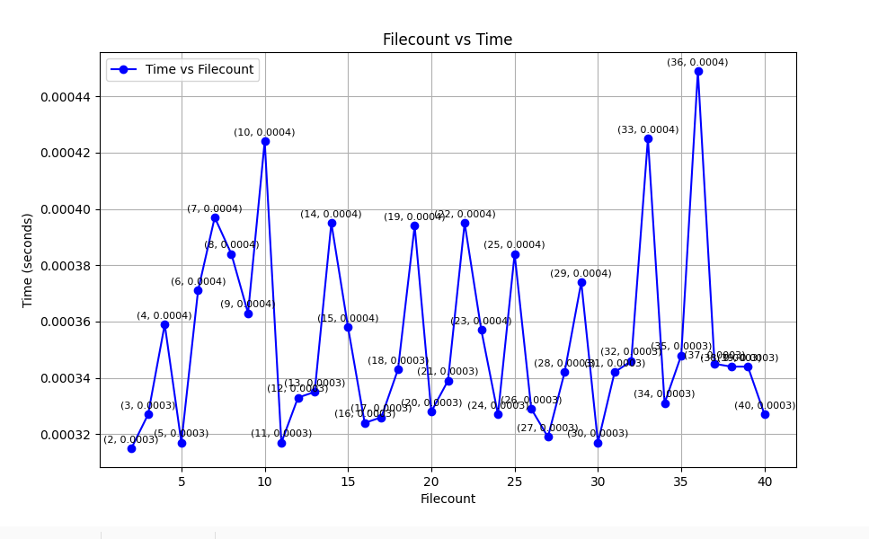

# Lazy Sort

*Lazy Sort* is a multi-threaded sorting program that organizes a list of files by `Name`, `ID`, or `Timestamp`. It uses threading for performance and mutex locks for safe data handling.

---

## Implementation Analysis

### Task Distribution
- **Count Sort**: The file list is divided into chunks for each thread, with hash values calculated in parallel based on the selected field. Mutex locks ensure safe updates to the shared count array.
- **Merge Sort**: Each merge operation uses threads to sort left and right halves, with threads merging results at each level.

### Pros and Cons
- **Pros**: Threads improve speed, especially for larger datasets, by dividing the work across cores.
- **Cons**: For smaller datasets, thread and mutex overhead can reduce efficiency.

---

## Execution Time Analysis

Execution times were measured for small, medium, and large datasets to assess scalability.

1. **Small Dataset**: Minimal speed improvement due to overhead.
2. **Medium Dataset**: Threads enhance performance by splitting tasks efficiently.
3. **Large Dataset**: Both sorting methods scale well, though merge sort benefits more due to its balanced structure.

**Summary**: Count Sort scales for small data ranges, while Merge Sort performs better on larger, more complex datasets.

---

## GRAPHS
### Count Sort

### Merge Sort

## Memory Usage Overview

- **Small Datasets**: Both sorting methods use minimal memory.
- **Large Datasets**: Count Sort requires more memory for diverse data ranges due to the size of the count array, while Merge Sort’s memory needs grow with recursion depth.

---

## Summary

- **Count Sort**: Best for smaller or simpler datasets, but its memory use can grow significantly with data range.
- **Merge Sort**: More stable for large datasets due to predictable memory usage.

### Potential Optimizations
- **Memory-Efficient Count Sort**: Adjust the count array size for high data diversity.
- **Hybrid Approach**: Use Count Sort for small ranges and Merge Sort for larger datasets.
